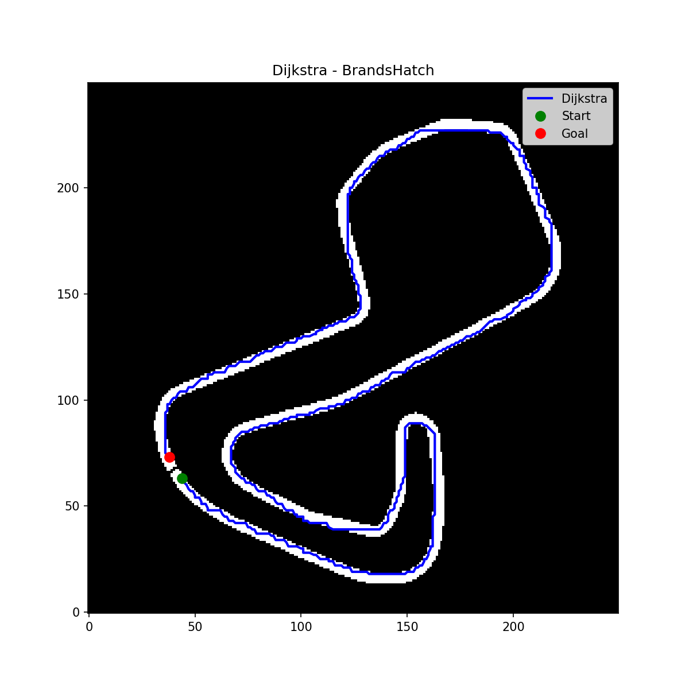
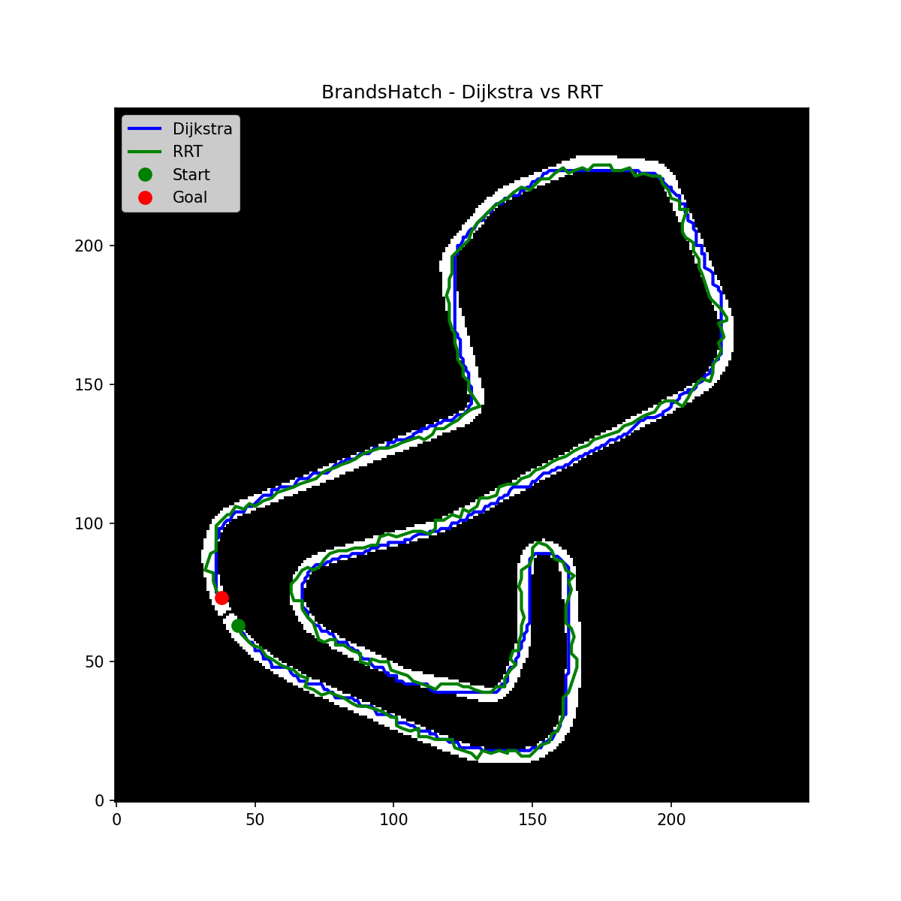
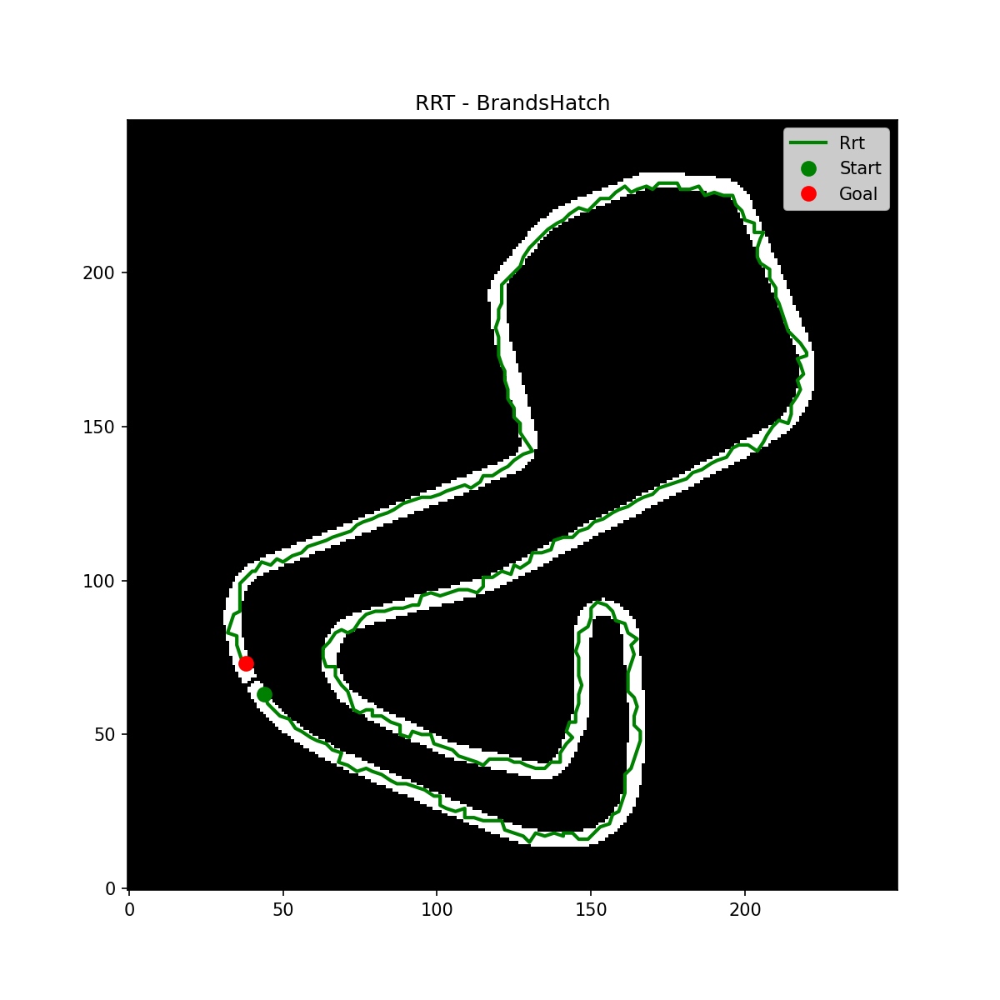

# Parte A — Generación de trayectorias globales (Dijkstra + RRT)

Se generaran las trayectorias globales
sobre el mapa **BrandsHatch** usando dos algoritmos de planificación:

- **Dijkstra** (algoritmo asignado)
- **RRT** (segunda técnica de planificación)

Para cada algoritmo se generan waypoints con dos espaciados distintos:
**0.5 m** y **1.0 m**, cubriendo la vuelta completa del circuito 

Repositorio base: [widegonz/Global_Planner](https://github.com/widegonz/Global_Planner),
adaptado del repositorio original [ai-winter/python_motion_planning](https://github.com/ai-winter/python_motion_planning).

---

## 1. Requisitos

- Python 3.8+
- `pip`
- `python3-venv`
- Linux (probado en Ubuntu 22.04)

---

## 2. Instalación

```bash
sudo apt update
sudo apt install python3-venv

git clone https://github.com/widegonz/Global_Planner.git
cd Global_Planner

python3 -m venv venv
source venv/bin/activate

pip install --upgrade pip
pip install -r requirements.txt
```

Verifica que el mapa **BrandsHatch** esté disponible en:

```
Global_Planner/Mapas-F1Tenth/BrandsHatch_map.yaml
Global_Planner/Mapas-F1Tenth/BrandsHatch_map.png   (o el nombre que indique el .yaml)
```

---

## 3. Estructura del pipeline (`f1tenth/plan_brandshatch.py`)

El script principal realiza, en orden:

1. **Carga y binarización del mapa** (`load_map`): lee el `.yaml` + `.png`,
   binariza (libre/obstáculo) según umbral de gris, dilata levemente los
   obstáculos y aplica *downsampling* (factor 8 → celdas de ~0.4 m).
2. **Aislamiento del corredor de pista** (`isolate_track_corridor`): usa
   componentes conexas para descartar tanto el exterior del circuito como el
   interior (*infield*), dejando libre únicamente el pasillo real de la
   pista.
3. **Definición de start/goal para una vuelta completa**
   (`pick_lap_start_goal` + `add_start_finish_wall`): traza una pared delgada
   perpendicular a la pista en un punto de corte, y coloca `start` y `goal` a
   cada lado de esa pared. Esto obliga a que cualquier planificador deba
   recorrer **toda la vuelta** para conectar ambos puntos (en vez de un
   atajo directo).
4. **Construcción del grid de planeación** (`grid_from_map`): convierte el
   mapa binarizado en un objeto `Grid` (de `python_motion_planning`) con el
   conjunto de celdas obstáculo.
5. **Planificación con Dijkstra** usando `SearchFactory()("dijkstra", ...)`.
6. **Planificación con RRT** usando una clase adaptada `GridRRT` (ver
   sección 5).
7. **Remuestreo y suavizado** de cada camino a 0.5 m y 1.0 m (Parte B, ver
   documento aparte).
8. **Exportación** a CSV y generación de gráficas.

---

## 4. Ejecución

```bash
cd Global_Planner
source venv/bin/activate
python3 f1tenth/plan_brandshatch.py
```

Salida esperada en consola:

```
Cargando mapa BrandsHatch...
  (pick_lap_start_goal) offset usado: 6 celdas
Rejilla: 250 x 250 celdas, resolucion 0.400 m/celda
Start (grid): (44, 63) -> world (...)
Goal  (grid): (38, 73) -> world (...)

[1/2] Ejecutando Dijkstra...
  Dijkstra: 785 nodos, costo=902.47, t=0.40s

[2/2] Ejecutando RRT...
  RRT: N nodos, costo=..., t=...s
```

---

## 5. Adaptación de RRT al grid (`GridRRT`)

El RRT original de `python_motion_planning` está pensado para un entorno
tipo `Map` (obstáculos como rectángulos/círculos). Como aquí se usa un
`Grid` (rejilla discreta proveniente del mapa binarizado), se implementó una
subclase `GridRRT(RRT)` con:

- **Chequeo de colisión O(1) por celda**, en vez de geometría continua.
- **Muestreo dirigido al corredor real de la pista**: en vez de muestrear
  uniformemente sobre todo el rectángulo 250×250 de la rejilla (donde la
  gran mayoría del área es obstáculo, ya que la pista es un pasillo
  angosto), se muestrea directamente entre las celdas libres reales de la
  pista. Esto fue clave para que el árbol lograra crecer y converger.
- **Sin inflación adicional de obstáculos** (`inflation=0`): se comprobó que
  usar una inflación extra de 1 celda alrededor de cada punto podía marcar
  el propio `start`/`goal` como "obstáculo" en zonas angostas del circuito,
  bloqueando el crecimiento del árbol desde el primer nodo.

Parámetros usados:

| Parámetro          | Valor  |
|---------------------|--------|
| `max_dist`          | 3.0 celdas |
| `sample_num`        | 20000  |
| `goal_sample_rate`  | 0.1    |
| `inflation`         | 0      |

---

## 6. Problemas encontrados y solución (bitácora de depuración)

Durante el desarrollo surgieron 3 fallas, documentadas aquí porque son
comunes al adaptar planificadores de `python_motion_planning` a un mapa real:

1. **Dijkstra no encontraba camino** — causa: `grid_from_map` aplicaba un
   volteo vertical (`h - 1 - y`) al construir el conjunto de obstáculos,
   pero `start`/`goal` no se volteaban, desalineando ambos sistemas de
   coordenadas. **Solución:** eliminar el volteo, usando `(x, y)`
   directamente (igual que el resto del pipeline de coordenadas).
2. **RRT no encontraba camino (0 nodos explorados fuera del start)** — causa:
   muestreo uniforme sobre todo el bounding box del grid, prácticamente
   nunca cayendo dentro del pasillo angosto de la pista. **Solución:**
   muestrear entre las celdas libres reales precomputadas.
3. **RRT seguía sin explorar ni un nodo (`nodos explorados=1`)** — causa:
   `inflation=1` en `GridRRT` marcaba el propio `start` como obstáculo en
   zonas angostas. **Solución:** usar `inflation=0`, consistente con el
   criterio ya usado por Dijkstra.

---

## 7. Archivos generados

En `f1tenth/output/`:

| Archivo | Descripción |
|---|---|
| `dijkstra_path_raw_0.5m.csv` | Camino Dijkstra crudo, remuestreado cada 0.5 m (sin suavizar) |
| `dijkstra_path_raw_1.0m.csv` | Camino Dijkstra crudo, remuestreado cada 1.0 m (sin suavizar) |
| `rrt_path_raw_0.5m.csv` | Camino RRT crudo, remuestreado cada 0.5 m (sin suavizar) |
| `rrt_path_raw_1.0m.csv` | Camino RRT crudo, remuestreado cada 1.0 m (sin suavizar) |
| `dijkstra_path.png` | Gráfica individual de la trayectoria Dijkstra sobre el mapa |
| `rrt_path.png` | Gráfica individual de la trayectoria RRT sobre el mapa |
| `dijkstra_vs_rrt.png` | Comparación visual de ambas trayectorias |

> Los archivos `dijkstra_path_0.5m.csv`, `dijkstra_path_1.0m.csv`,
> `rrt_path_0.5m.csv`, `rrt_path_1.0m.csv` corresponden a la versión
> **suavizada** (Parte B) — ver `PARTE_B_SUAVIZADO.md`.








Formato de cada CSV:

```csv
x,y
-4.191911365086348,-38.15832098289893
-3.6918913796781485,-38.158272733855405
...
```

---

## 8. Cómo subir esto a GitHub

```bash
cd Global_Planner
git add f1tenth/plan_brandshatch.py f1tenth/output/ PARTE_A_GENERACION_TRAYECTORIAS.md
git commit -m "Parte A: generacion de trayectorias globales (Dijkstra y RRT) sobre BrandsHatch"
git push origin master
```
