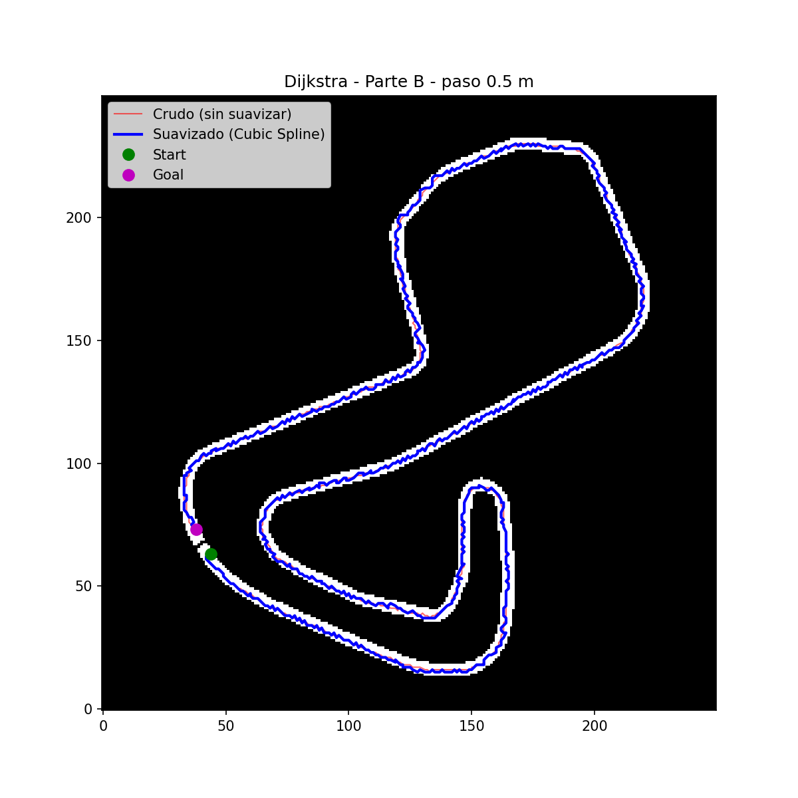
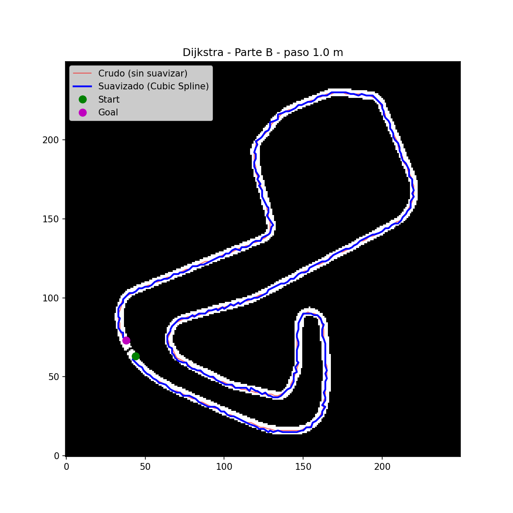
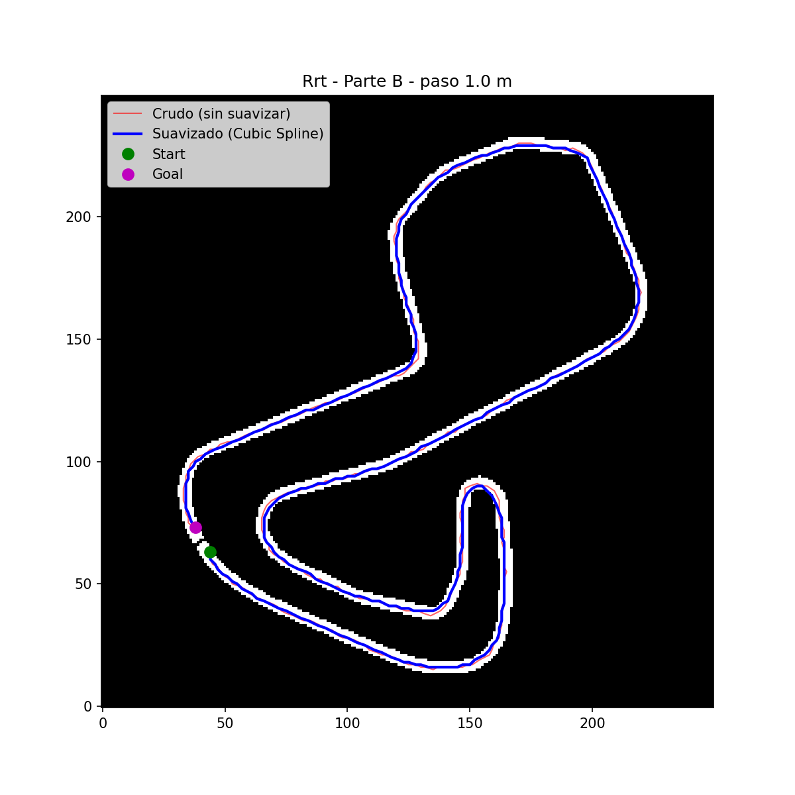

# Planificación y Suavizado de Trayectorias Globales — BrandsHatch

Este documento explica, paso a paso, todo el proceso realizado sobre el
mapa **BrandsHatch**: generación de trayectorias globales con dos
algoritmos de planificación (**Parte A**) y su posterior suavizado
(**Parte B**), cumpliendo con la separación de waypoints de **0.5 m** y
**1.0 m** en ambos casos.

Repositorio base: [widegonz/Global_Planner](https://github.com/widegonz/Global_Planner),
adaptado de [ai-winter/python_motion_planning](https://github.com/ai-winter/python_motion_planning).

Algoritmos usados:
- **Dijkstra** (algoritmo asignado)
- **RRT** (segunda técnica de planificación)

Script principal: `f1tenth/plan_brandshatch.py`

---

## 0. Mapa original

Mapa BrandsHatch tal como se recibe (`.yaml` + `.png`), antes de cualquier
procesamiento (binarización, downsampling, aislamiento del corredor).

<!-- 📌 COLOCAR AQUÍ: captura del mapa original (BrandsHatch_map.png) -->


---

## 1. Requisitos e instalación

```bash
sudo apt update
sudo apt install python3-venv

git clone https://github.com/widegonz/Global_Planner.git
cd Global_Planner

python3 -m venv venv
source venv/bin/activate

pip install --upgrade pip
pip install -r requirements.txt
```

Verifica que el mapa esté en:
```
Global_Planner/Mapas-F1Tenth/BrandsHatch_map.yaml
Global_Planner/Mapas-F1Tenth/BrandsHatch_map.png
```

Ejecución completa (genera todo lo de este documento en un solo paso):
```bash
python3 f1tenth/plan_brandshatch.py
```

---

## PARTE A — Generación de trayectorias globales

**Objetivo de la rúbrica:** generar 2 trayectorias con 2 algoritmos
diferentes (Dijkstra y RRT), con waypoints separados 0.5 m y 1 m,
recorriendo el mapa completo (no un tramo).

### A.1 — Pipeline de procesamiento del mapa

1. **`load_map`** — carga el `.yaml` + `.png`, binariza (libre = 0,
   obstáculo = 1) según umbral de gris, dilata levemente los obstáculos y
   aplica *downsampling* (factor 8 → celdas de ~0.4 m/celda).
2. **`isolate_track_corridor`** — usa componentes conexas para descartar
   tanto el exterior del circuito como el interior (*infield*), dejando
   libre únicamente el pasillo real de la pista.
3. **`pick_lap_start_goal` + `add_start_finish_wall`** — traza una pared
   delgada perpendicular a la pista en un punto de corte, y coloca `start`
   y `goal` a cada lado. Esto obliga a que el planificador recorra
   **toda la vuelta** para conectar ambos puntos.
4. **`grid_from_map`** — construye el objeto `Grid` de
   `python_motion_planning` con el conjunto de celdas obstáculo.

### A.2 — Dijkstra

Ejecutado con `SearchFactory()("dijkstra", start=start_map, goal=goal_map, env=env)`.

### A.3 — RRT adaptado a grid (`GridRRT`)

El RRT original de `python_motion_planning` está pensado para un entorno
`Map` (obstáculos geométricos). Se implementó `GridRRT(RRT)` con:

- Chequeo de colisión O(1) contra el grid discreto.
- **Muestreo dirigido**: en vez de muestrear uniforme sobre todo el
  rectángulo del grid (donde casi todo es obstáculo, ya que la pista es un
  pasillo angosto), se muestrea directamente entre las celdas libres
  reales de la pista.
- **Sin inflación adicional** (`inflation=0`): usar inflación extra
  marcaba el propio `start`/`goal` como obstáculo en zonas angostas,
  impidiendo que el árbol creciera.

| Parámetro | Valor |
|---|---|
| `max_dist` | 3.0 celdas |
| `sample_num` | 20000 |
| `goal_sample_rate` | 0.1 |
| `inflation` | 0 |

### A.4 — Centrado en el eje del corredor (*centerline pull*)

Tanto el camino de Dijkstra como el de RRT, tal como salen del
planificador, siguen las celdas del grid o el árbol de muestreo — no
necesariamente el centro geométrico del pasillo. Se agregó un paso de
**transformada de distancia** (`compute_distance_field`, basada en
`scipy.ndimage.distance_transform_edt`): para cada celda libre se calcula
su distancia a la pared más cercana, y luego cada punto del camino se
empuja iterativamente en dirección al gradiente de ese campo
(`pull_to_centerline`), acercándolo al eje medio de la pista. Esto produce
una trayectoria más realista y visualmente centrada, en vez de pegada a
un borde.

### A.5 — Remuestreo a 0.5 m y 1.0 m (waypoints crudos, sin suavizar)

Remuestreo por **longitud de arco** (`resample_linear`), no por índice,
para obtener espaciado real y uniforme entre waypoints.

Archivos generados (`f1tenth/output/`):
- `dijkstra_path_raw_0.5m.csv`
- `dijkstra_path_raw_1.0m.csv`
- `rrt_path_raw_0.5m.csv`
- `rrt_path_raw_1.0m.csv`

Formato:
```csv
x,y
-4.191911365086348,-38.15832098289893
-3.6918913796781485,-38.158272733855405
...
```

### A.6 — Resultados Parte A (trayectorias crudas / centradas, antes del suavizado)

**Dijkstra — 0.5 m**
<!-- 📌 COLOCAR AQUÍ -->


**Dijkstra — 1.0 m**
<!-- 📌 COLOCAR AQUÍ -->


**RRT — 0.5 m**
<!-- 📌 COLOCAR AQUÍ -->


**RRT — 1.0 m**
<!-- 📌 COLOCAR AQUÍ -->


**Comparación general Dijkstra vs RRT (vuelta completa)**
<!-- 📌 COLOCAR AQUÍ: dijkstra_vs_rrt.png -->


---

## PARTE B — Suavizado de trayectoria (Curve Generation)

**Objetivo de la rúbrica:** aplicar suavizado a las trayectorias de la
Parte A (Dijkstra y RRT, 0.5 m y 1 m), evitando esquinas agudas, para que
la ruta sea seguible por un vehículo con restricciones de giro (F1TENTH).

### B.1 — Método: Cubic Spline por longitud de arco

Se usa `python_motion_planning.curve_generation.CubicSpline`,
parametrizado por longitud de arco acumulada (`smooth_and_resample`):

1. Se eliminan puntos duplicados/casi coincidentes.
2. Se calcula la longitud de arco `s` acumulada entre waypoints.
3. Se ajusta un spline cúbico de `x(s)` y de `y(s)` por separado.
4. Se evalúa en pasos uniformes de `s` (0.5 m o 1.0 m).

### B.2 — Pre-filtro de media móvil (solo RRT)

RRT produce un camino crudo con zigzag (propio del muestreo aleatorio del
árbol). Un spline cúbico es *interpolante* (pasa exacto por cada punto), y
al recibir un camino ruidoso puede **amplificar** el zigzag en vez de
suavizarlo. Por eso, antes del spline, el camino de RRT pasa por un filtro
de **media móvil** (`moving_average_filter`, ventana de 7 puntos) que
atenúa el ruido de alta frecuencia sin desplazar la trayectoria general.
Este pre-filtro no se aplica a Dijkstra (no lo necesita).

### B.3 — Validación con curvatura

Curvatura discreta: `k = |x'y'' - y'x''| / (x'^2 + y'^2)^1.5`
(`path_curvature_stats`). Un valor más bajo y sin picos = trayectoria más
suave y factible.

<!-- 📌 COLOCAR AQUÍ: pega los valores impresos en consola al ejecutar
     python3 f1tenth/plan_brandshatch.py, en la seccion "PARTE B" -->

| Algoritmo | Paso | Curvatura media (antes → después) | Curvatura máxima (antes → después) |
|---|---|---|---|
| Dijkstra | 0.5 m | `___` → `___` | `___` → `___` |
| Dijkstra | 1.0 m | `___` → `___` | `___` → `___` |
| RRT | 0.5 m | `___` → `___` | `___` → `___` |
| RRT | 1.0 m | `___` → `___` | `___` → `___` |

### B.4 — Resultados Parte B (antes/después del suavizado)

**Dijkstra — 0.5 m (crudo vs. suavizado)**
<!-- 📌 COLOCAR AQUÍ: dijkstra_smooth_vs_raw_0.5m.png -->


**Dijkstra — 1.0 m (crudo vs. suavizado)**
<!-- 📌 COLOCAR AQUÍ: dijkstra_smooth_vs_raw_1.0m.png -->


**RRT — 0.5 m (crudo vs. suavizado)**
<!-- 📌 COLOCAR AQUÍ: rrt_smooth_vs_raw_0.5m.png -->


**RRT — 1.0 m (crudo vs. suavizado)**
<!-- 📌 COLOCAR AQUÍ: rrt_smooth_vs_raw_1.0m.png -->


**Trayectoria final Dijkstra (suavizada, centrada, vuelta completa)**
<!-- 📌 COLOCAR AQUÍ: dijkstra_path.png -->


**Trayectoria final RRT (suavizada, centrada, vuelta completa)**
<!-- 📌 COLOCAR AQUÍ: rrt_path.png -->


### B.5 — Interpretación de resultados

<!-- 📌 COLOCAR AQUÍ: 2-3 lineas propias explicando que observas en las
     graficas y en la tabla de curvatura (ej: RRT mejora mucho mas que
     Dijkstra porque partia de un camino mas ruidoso, etc.) -->

---

## 2. Archivos finales generados

En `f1tenth/output/`:

| Archivo | Parte | Descripción |
|---|---|---|
| `dijkstra_path_raw_0.5m.csv` | A | Dijkstra crudo/centrado, 0.5 m, sin suavizar |
| `dijkstra_path_raw_1.0m.csv` | A | Dijkstra crudo/centrado, 1.0 m, sin suavizar |
| `rrt_path_raw_0.5m.csv` | A | RRT crudo/centrado, 0.5 m, sin suavizar |
| `rrt_path_raw_1.0m.csv` | A | RRT crudo/centrado, 1.0 m, sin suavizar |
| `dijkstra_path_0.5m.csv` | B | Dijkstra suavizado, 0.5 m |
| `dijkstra_path_1.0m.csv` | B | Dijkstra suavizado, 1.0 m |
| `rrt_path_0.5m.csv` | B | RRT suavizado (pre-filtro + spline), 0.5 m |
| `rrt_path_1.0m.csv` | B | RRT suavizado (pre-filtro + spline), 1.0 m |
| `dijkstra_path.png` | A/B | Trayectoria Dijkstra final sobre el mapa |
| `rrt_path.png` | A/B | Trayectoria RRT final sobre el mapa |
| `dijkstra_vs_rrt.png` | A | Comparación Dijkstra vs RRT |
| `dijkstra_smooth_vs_raw_0.5m.png` | B | Dijkstra: crudo vs suavizado, 0.5 m |
| `dijkstra_smooth_vs_raw_1.0m.png` | B | Dijkstra: crudo vs suavizado, 1.0 m |
| `rrt_smooth_vs_raw_0.5m.png` | B | RRT: crudo vs suavizado, 0.5 m |
| `rrt_smooth_vs_raw_1.0m.png` | B | RRT: crudo vs suavizado, 1.0 m |

---

## 3. Cómo subir esto a GitHub

```bash
cd Global_Planner
git add f1tenth/plan_brandshatch.py f1tenth/output/ README_TRAYECTORIAS.md
git commit -m "Parte A y B: generacion y suavizado de trayectorias (Dijkstra y RRT) sobre BrandsHatch"
git push origin master
```

> Nota: si colocas las imágenes en una subcarpeta distinta a la raíz del
> repo, actualiza las rutas `` de este documento en
> consecuencia (deben ser relativas a la ubicación de este `.md`).
